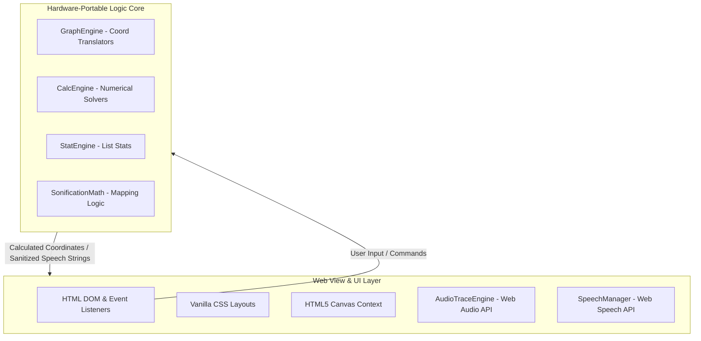

# Accessible Talking & Audio Graphing Calculator

A high-contrast, large-print talking graphing calculator designed for blind and visually impaired users. This project serves as a **web-based living prototype and logical blueprint** for a future physical handheld device driven by an ESP32-S3 microcontroller.

---

## 1. Project Overview & Mission Statement

Modern STEM education remains significantly inaccessible to blind and visually impaired (BVI) students due to a lack of affordable, real-time visual, textual, and auditory mathematical tools. This gap was historically filled by the **Orion TI-84 Plus** expansion, which has been discontinued, leaving educators and students without a dedicated hardware solution.

The mission of this project is to:
* **Restore Access:** Provide a low-cost, open-source talking and audio graphing calculator alternative.
* **Deliver Multi-Modal Feedback:** Combine high-contrast, large-print visual layouts, high-fidelity real-time speech feedback, and intuitive sonification (audio graphing) of mathematical curves.
* **Provide an Embedded Blueprint:** Ensure the application's core logic is completely decoupled from the web runtime, serving as a strict structural guide for porting to bare-metal C++ firmware on the ESP32-S3.

---

## 2. The Golden Rule of Decoupling (UI vs. Core Engine)

To preserve the portability of the calculator's logic, the codebase strictly enforces a **unidirectional boundary** between the user interface and the mathematical/sonification engines. 



### The View/UI Layer (Web Only)
* **Scope:** HTML forms, CSS grid/flexbox layouts, DOM event listeners (keyboard navigation), HTML5 Canvas 2D context drawing, and browser-specific audio/speech APIs.
* **Hardware Transition:** This layer will be **entirely discarded** when porting to C++. The DOM and CSS will be replaced by physical button interrupts and keyboard matrix scanning. The HTML5 Canvas drawing calls will be ported to an embedded graphics library, such as **LovyanGFX** or **LVGL**.

### The Logic Core (Hardware Portable)
* **Scope:** Coordinate translation math, numerical solvers (roots, derivatives, integrals), list statistics algorithms, and raw sonification frequency/panning calculations.
* **Constraints:** Must consist of **pure, framework-free JavaScript** relying exclusively on standard arrays and primitive data types. It must have **zero knowledge of the DOM**, window objects, or web-specific variables.
* **Key Core Components:**
  * **`GraphEngine`:** Handles math-to-pixel and pixel-to-math translation, and generates data point vectors without interacting with canvas contexts.
  * **`CalcEngine`:** Houses pure mathematical algorithms for finding roots, minimums, maximums, derivatives, and integrals.
  * **`StatEngine`:** Performs descriptive 1-variable and 2-variable statistics, linear regressions, and statistical distribution computations.
  * **`SonificationMath`:** Executes raw frequency mapping and stereo panning ratios based on coordinate values.

---

## 3. ESP32-S3 Target Constraints & Hardware Mapping

Developers must write code under the assumption that it will execute on an ESP32-S3 microcontroller with a fixed screen and limited hardware resources.

| Constraint Area | Web Implementation Details | Embedded Hardware Target & Porting Roadmap |
| :--- | :--- | :--- |
| **SRAM & Memory** | Dynamic JavaScript arrays and garbage collection. | **Strict Static Bounds:** ESP32-S3 has limited SRAM (~512KB). Any array structure (such as the Stats List Editor columns `L1`–`L6`) must have fixed maximum bounds (e.g., `MAX_LIST_SIZE = 100`) to prevent heap fragmentation. |
| **Screen Resolution** | Scale-to-fit responsive HTML5 Canvas. | **Fixed Buffer Mapping:** Visual layouts and grid systems must be decoupled from the browser canvas size. Core coordinate math must adapt to a fixed 320x240 (or 480x320) LCD display. |
| **Expression Parsing** | Dependency on `math.js` parser in the browser. | **Lightweight Math Parser:** The heavy `math.js` parser will be replaced by a lean C/C++ mathematical evaluator, such as **TinyExpr**, or a custom Shunting-Yard parser. |
| **Processing Limits** | High-performance CPU cores. | **Lightweight Numerical Algorithms Only:** Complex Computer Algebra Systems (CAS) or $O(N^2)$ iterative sweeps are strictly forbidden. All mathematical tools must run in $O(N)$ linear time or better. |

### Preserving Performance in Math Routines
To accommodate the ESP32-S3 processor, all calculus and solver routines in `CalcEngine` must utilize lightweight, direct numerical approximations:
* **Root Finding:** Use the bisection method (`findRoot`) with a bounded number of iterations instead of complex multi-dimensional solvers.
* **Derivatives:** Compute $dy/dx$ via Central Finite Differences:
  $$\frac{dy}{dx} \approx \frac{f(x + h) - f(x - h)}{2h}$$
* **Definite Integrals:** Compute $\int_{a}^{b} f(x)dx$ via the Trapezoidal Rule over a fixed number of segments:
  $$\int_{a}^{b} f(x) dx \approx \frac{h}{2} \left[ f(a) + 2\sum_{i=1}^{N-1}f(a + ih) + f(b) \right]$$

---

## 4. Audio & Sonification Core Requirements

Sonification represents a curve's visual shape using sound. As the cursor traces from left to right along a function $Y = f(X)$, the pitch corresponds to the $Y$-value, and the stereo panning corresponds to the $X$-value.

### Web to Embedded Audio Roadmap
* **Web Audio API (`AudioTraceEngine`):** Employs oscillators, stereo panners, and linear gain ramps to play sound in the browser.
* **Embedded Sonification:** The sound output maps to an external **I2S DAC** (e.g., MAX98357A) driven by a Direct Digital Synthesis (DDS) sine wave lookup table or an embedded library such as **Mozzi**.

### Sound Parameter Mapping
1. **Pitch (Y-axis):** Map mathematical $Y$-values exponentially to frequency to match human logarithmic pitch perception.
   $$f(y) = f_{\text{min}} \cdot \left( \frac{f_{\text{max}}}{f_{\text{min}}} \right)^{y_{\text{norm}}}$$
   *Default: $y_{\text{norm}}$ is mapped from $[Y_{\text{min}}, Y_{\text{max}}]$ to $[200\text{ Hz}, 1000\text{ Hz}]$.*
2. **Panning (X-axis):** Map mathematical $X$-values linearly to stereo panning coefficients.
   $$p(x) = -1.0 + 2.0 \cdot \left( \frac{x - X_{\text{min}}}{X_{\text{max}} - X_{\text{min}}} \right)$$
   *In hardware, this translates directly to left and right channel I2S volume scaling ratios.*

### The Non-Finite Value Gate Rule

> [!IMPORTANT]
> **Crash Protection:** In an embedded environment, attempting to generate or feed undefined (`NaN`), infinite (`Infinity`), or out-of-bounds values to the DAC buffer will cause audio pops, hardware exceptions, or watchdog timer resets.

All audio frequency and panning variables **must** pass through validation gates before reaching any driver output:

```javascript
// Strict validation gate in application logic
if (isNaN(yVal) || !isFinite(yVal)) {
    // Gracefully fade volume to 0 to prevent clicking and hardware exception
    this.rampDownVolume();
} else {
    // Proceed with sonification updates
    this.updatePitchAndPan(yVal, xVal);
}
```

---

## 5. Speech Wrapper Protocol

The calculator provides textual information to the user through spoken audio. To ensure speech hardware portability, the application abstracts all speech actions behind a `SpeechManager` wrapper.

### The Speech Manager Workflow
1. **Clean Input Delivery:** The core logic must never send rich markdown or complex symbols. Only clean, sanitized alphanumeric text strings are permitted.
2. **Text Sanitization:** The manager replaces mathematical shorthands with fully spoken words (e.g., translating `sin` to `"sine"`, `NaN` to `"undefined"`, and `-` to `"negative"`).
3. **Hardware Mapping:** While the web utilizes the browser's `window.speechSynthesis` API, the ESP32-S3 will map this class to send commands over UART or I2C to a physical **DFRobot Gravity Speech Synthesis Module**.

```mermaid
sequenceDiagram
    participant Core as Core Logic
    participant SM as SpeechManager (Wrapper)
    participant WebTTS as Web Speech API (Web)
    participant Gravity as DFRobot Gravity Module (ESP32)

    Core->>SM: speak("y1 = sin(x)")
    Note over SM: Translates string to:<br/>"Y 1 equals sine of X"
    
    rect rgb(30, 30, 40)
        Note over SM, WebTTS: Web Flow
        SM->>WebTTS: SpeechSynthesisUtterance("Y 1 equals sine of X")
    end
    
    rect rgb(40, 30, 30)
        Note over SM, Gravity: ESP32 Hardware Flow
        SM->>Gravity: UART Transmit: [0xFD, 0x00, 0x14, 0x01, "Y 1 equals sine of X"]
    end
```



---

## 6. Guidelines for Future Features (Developer Checklist)

Before adding any mathematical, statistical, or calculus-oriented feature to this codebase, you must review and satisfy the following checklist:

- [ ] **Decoupled from DOM:** The feature logic resides in a pure JavaScript class (`StatEngine`, `CalcEngine`, or a new domain-specific core engine) and does not reference `document`, `window`, CSS styles, or DOM elements.
- [ ] **No Dynamic Memory Leaks:** The algorithm utilizes fixed or bounded arrays. Avoid heavy string manipulation loops, unbounded nesting, or excessive object allocations.
- [ ] **No Heavy External Dependencies:** The implementation must rely on native JS math primitives (`Math.sin`, `Math.sqrt`, etc.) or simple logic blocks. Do not introduce new third-party npm packages or CDNs in the logic core.
- [ ] **Lightweight Complexity ($O(N)$ or better):** Avoid algorithms that require nested iterative scans over coordinate arrays. If computing values at grid points, ensure a single linear pass.
- [ ] **Enforced Non-Finite Value Gates:** All variables fed into the coordinate generators or audio sonification layers are explicitly checked with `isNaN()` and `isFinite()`.
- [ ] **Unit-Testable Core:** The logic is fully testable in a headless environment (Node.js or similar) by feeding standard inputs and asserting standard outputs without a browser environment.
